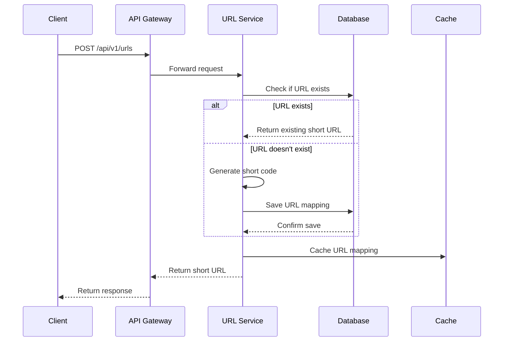
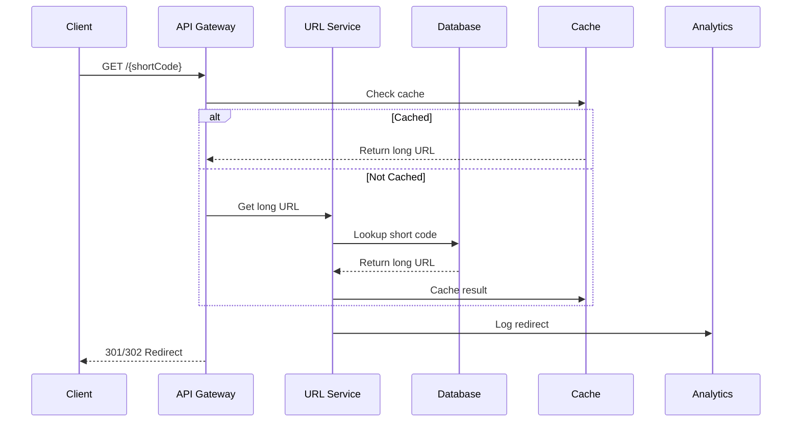

## Metadata Header
- **Created:** 2025-05-26
- **Author:** Rajat Garg
- **Status:** [DRAFT]
- **Last Modified:** 2025-05-26

# System Patterns: URL Shortener Service

## 🏗 Architectural Patterns

### 1. Layered Architecture
```
┌─────────────────────────────────────────────────┐
│                  Presentation                   │
│  • REST Controllers                           │
│  • DTOs                                      │
│  • Exception Handlers                        │
└───────────────────────┬───────────────────────┘
                        │
                        ▼
┌─────────────────────────────────────────────────┐
│                    Service                      │
│  • Business Logic                             │
│  • Transaction Management                     │
│  • Service Composition                       │
└───────────────────────┬───────────────────────┘
                        │
                        ▼
┌─────────────────────────────────────────────────┐
│                  Repository                     │
│  • Data Access                                │
│  • Query Optimization                         │
│  • Caching                                    │
└───────────────────────┬───────────────────────┘
                        │
                        ▼
┌─────────────────────────────────────────────────┐
│                    Database                     │
│  • Tables                                     │
│  • Indexes                                    │
│  • Stored Procedures                          │
└─────────────────────────────────────────────────┘
```

### 2. CQRS Pattern
- **Commands**: For write operations (create, update, delete)
- **Queries**: For read operations (get, list, search)
- **Benefits**:
  - Optimized read and write paths
  - Independent scaling
  - Better performance for read-heavy workloads

### 3. Event Sourcing
- **Concept**: Store state changes as a sequence of events
- **Use Case**:
  - Audit logging
  - Analytics
  - Rebuilding state

## 🔄 Data Flow

### URL Shortening Flow


### URL Redirection Flow


## 🧩 Component Design

### 1. URL Service
- **Responsibilities**:
  - URL shortening logic
  - Custom alias management
  - Expiration handling
  - Validation
- **Interfaces**:
  - `URLService`
  - `URLValidator`
  - `URLGenerator`

### 2. Analytics Service
- **Responsibilities**:
  - Click tracking
  - Geographic data
  - Device/browser info
  - Referrer tracking
- **Interfaces**:
  - `AnalyticsService`
  - `ClickTracker`
  - `ReportGenerator`

### 3. Cache Service
- **Responsibilities**:
  - URL caching
  - Cache invalidation
  - TTL management
- **Interfaces**:
  - `CacheService`
  - `CacheManager`

## 🧩 Design Patterns

### Repository Pattern
- **Implementation**: `UrlRepository` interface with `UrlRepositoryImpl` concrete class
- **Benefits**: Abstraction of data access, testability, separation of concerns
- **Key Methods**: `save()`, `findByShortCode()`, `incrementClickCount()`

### Caching Pattern
- **Implementation**: `UrlCacheService` with Redis backing store
- **Strategy**: Cache-aside pattern with TTL expiration
- **Configuration**: Explicit Redis authentication via `RedisConfig.kt`
- **Benefits**: Reduced database load, improved response times

### Data Transfer Objects (DTOs)
- **Implementation**: OpenAPI-generated model classes
- **Benefits**: Clean API contracts, validation, documentation
- **Examples**: `CreateUrlRequest`, `UrlResponse`

### Date/Time Handling
- **Pattern**: UTC standardization with explicit timezone conversion
- **Implementation**: 
  - All internal dates stored as `LocalDateTime`
  - API responses use `OffsetDateTime` with UTC timezone
  - Explicit conversion in controllers using `OffsetDateTime.of(localDateTime, ZoneOffset.UTC)`
- **Benefits**: Consistent date handling, timezone clarity, ISO-8601 compliance

## 🛡 Security Patterns

### 1. Rate Limiting
- **Pattern**: Token Bucket
- **Implementation**: Redis + Lua scripts
- **Rules**:
  - 100 requests/minute per IP
  - 1000 requests/day per API key
  - Dynamic limits for authenticated users

### 2. Input Validation
- **Layers**:
  1. API validation (DTOs)
  2. Business logic validation
  3. Database constraints
- **Techniques**:
  - Whitelist validation
  - Length checks
  - Pattern matching
  - SQL injection prevention

### 3. Authentication & Authorization
- **Pattern**: JWT-based auth
- **Flows**:
  - Client Credentials for service-to-service
  - OAuth 2.0 for user authentication (future)
- **Storage**: Secure HTTP-only cookies

## 📦 Data Patterns

### 1. Database Sharding
- **Strategy**: Hash-based sharding on short code
- **Shard Key**: First 2 characters of short code
- **Benefits**:
  - Even distribution
  - Horizontal scaling
  - Reduced contention

### 2. Caching Strategy
- **L1 Cache**: In-memory (Caffeine)
- **L2 Cache**: Redis
- **Eviction Policy**: LRU
- **TTL**:
  - Popular URLs: 7 days
  - Regular URLs: 24 hours
  - Expired URLs: Immediate invalidation

### 3. Data Retention
- **Active URLs**: Indefinite
- **Analytics Data**: 13 months
- **Logs**: 30 days
- **Backups**: 1 year

## 🔄 Integration Patterns

### 1. API Gateway
- **Functions**:
  - Request routing
  - Authentication
  - Rate limiting
  - Request/response transformation
  - Caching

### 2. Event-Driven Architecture
- **Events**:
  - URL created
  - URL accessed
  - URL expired
  - Analytics event
- **Consumers**:
  - Analytics service
  - Cache invalidation
  - Notification service

### 3. Circuit Breaker
- **Implementation**: Resilience4j
- **States**:
  - CLOSED: Normal operation
  - OPEN: Fail fast
  - HALF-OPEN: Limited requests
- **Configuration**:
  - Failure threshold: 50%
  - Wait duration: 30s
  - Minimum calls: 5

## 🚀 Performance Patterns

### 1. Read/Write Optimization
- **Read Path**:
  - Multi-level caching
  - Read replicas
  - Denormalization
- **Write Path**:
  - Write-behind cache
  - Batch processing
  - Asynchronous processing

### 2. Database Optimization
- **Indexing**:
  - Short code (unique)
  - User ID (for user-specific queries)
  - Expiration date (for cleanup)
- **Partitioning**:
  - By creation date
  - By user ID

### 3. Content Delivery
- **CDN Integration**:
  - Static assets
  - API responses
- **Edge Caching**:
  - Common redirects
  - Frequently accessed resources

## 🔗 Related Documents
- [Tech Context](./techContext.md)
- [Project Brief](./projectbrief.md)
- [Active Context](./activeContext.md)

---
### 2025-05-26
- Redis integration is now explicitly configured for secure access. Date/time serialization is UTC-compliant throughout the stack. All API endpoints follow OpenAPI spec.
